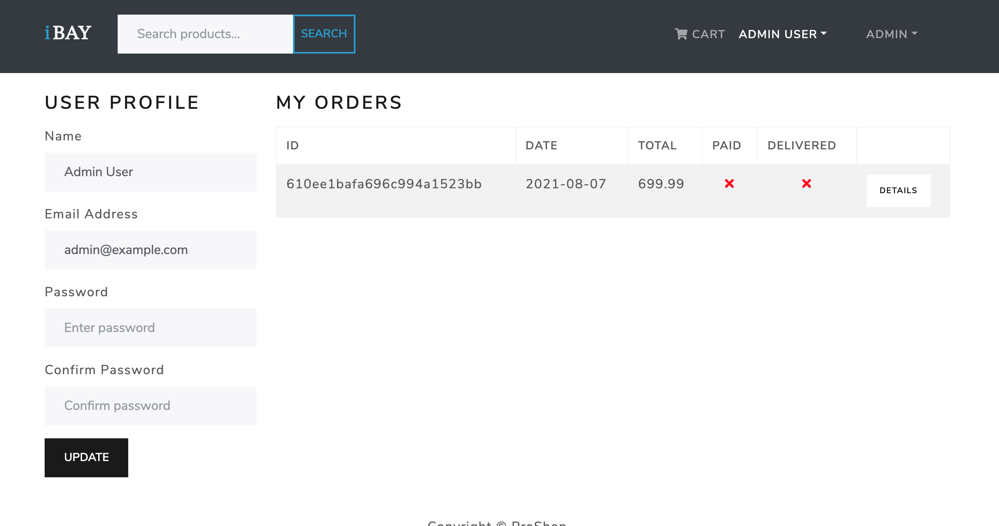
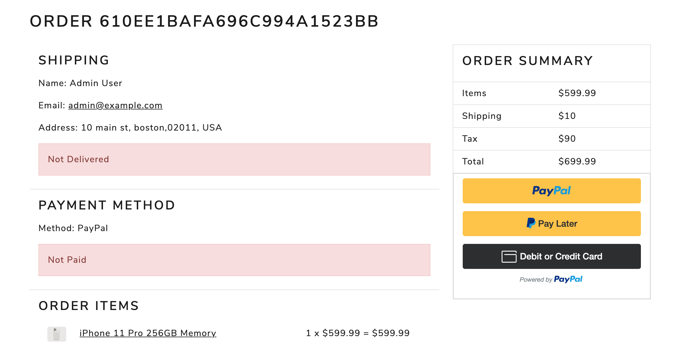

# Ibay

## Technologies Used

React / Redux / Express / Node / MongoDB / Javascript / JSON Web Tokens / Bootstrap / React-Bootstrap / Paypal API

## Project Description

Ibay is an eccomerce store that allows users to purchase items on the website using the Paypal API. Users can create an account and profile, as well as have their purchase history stored online. Users are able to search for products as well as read and write reviews for products. In addition, an admin user is has the ability to CRUD users and products as well as assign admin roles to other users. Pictures can be uploaded directly or a url can be used. Admin role has an additional productlist/userslist/orderlist pages and corresponding functionality.

## Quickstart

`cd to root folder`

`npm run dev`

\*\* Check out the live app on [Heroku](https://ibay-eccomerce.herokuapp.com/)

## License

MIT
